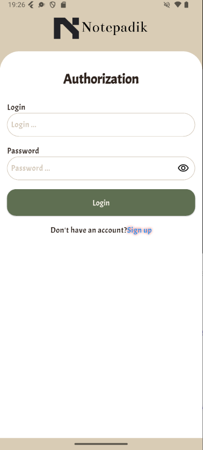
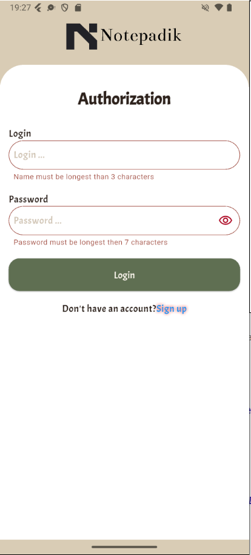
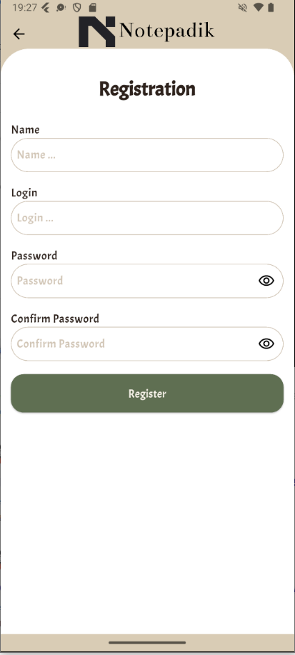
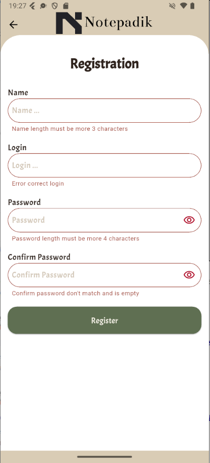
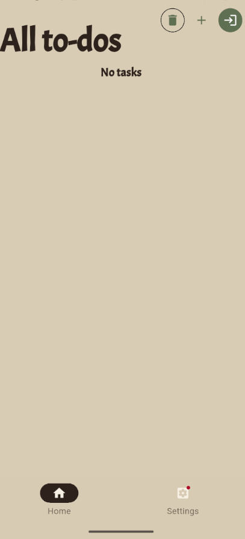
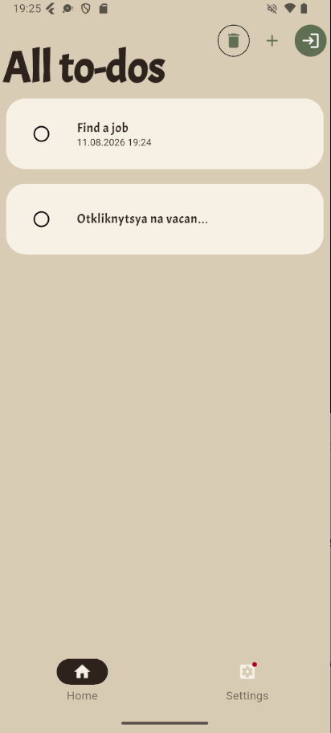
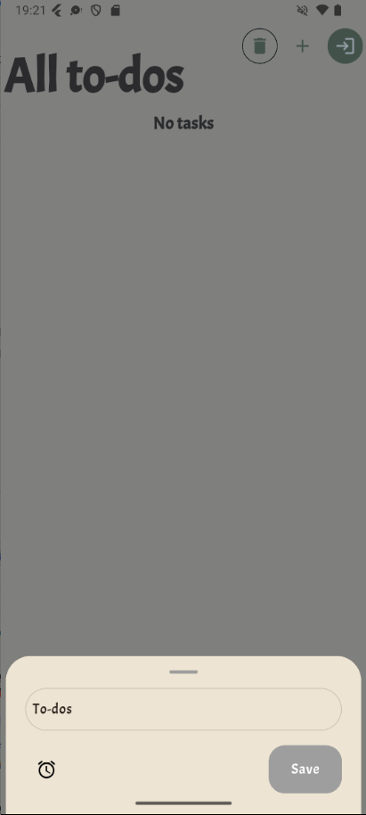
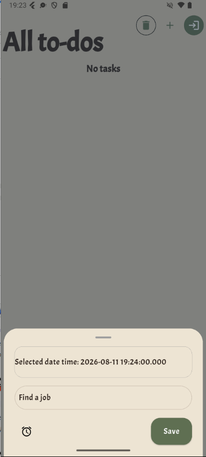
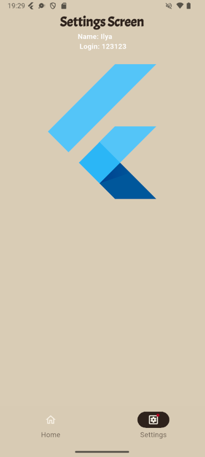
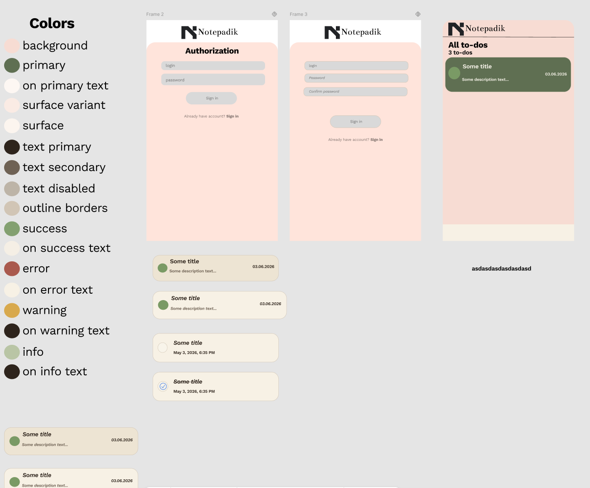

# Task tracker

Приложение-трекер задач с авторизацией, уведомлениями и локальным хранилищем.

**Проект портфолио.**
*Срок выполнения: 3-4 недели*

## Экраны

### Авторизация

### Регистрация

### Задачи

### Создание задачи

### Настройки
*Пока не реализовано*

## Технологии
- **Custom DI + ChangeNotifierProvider + Provider** — прокидывание зависимостей
- **flutter_local_notifications** — уведомления
- **shared_preferences** — локальное хранилище
- **intl** — определение timezone

## Архитектура
Future-first architecture

## Управление состоянием
Используется стандартный `ChangeNotifier`. В дальнейшем планируется миграция на `bloc`.

## Планы
- **Profile** — Добавить UI профиля, смену языка и смена темы приложения.
- **English support** — Интеграция мультиязычности(l10n).
- **ThemeMode** — Смена темы(в последствии через ThemeExtension).

## Дизайн
Самостоятельно разработал в Figma макет.

